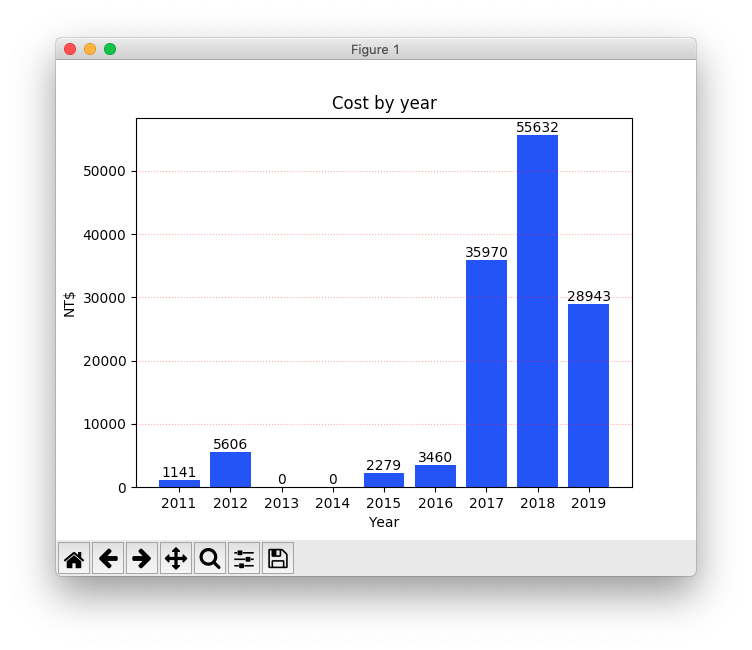
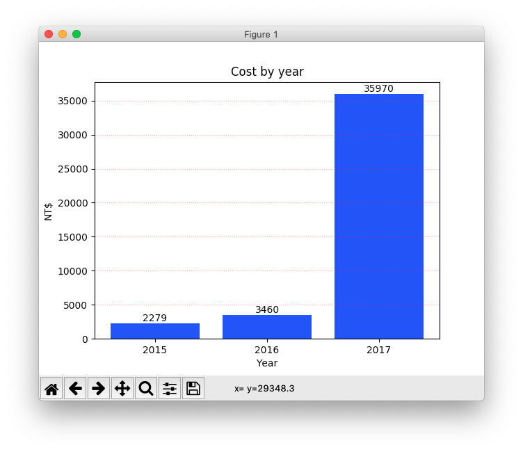
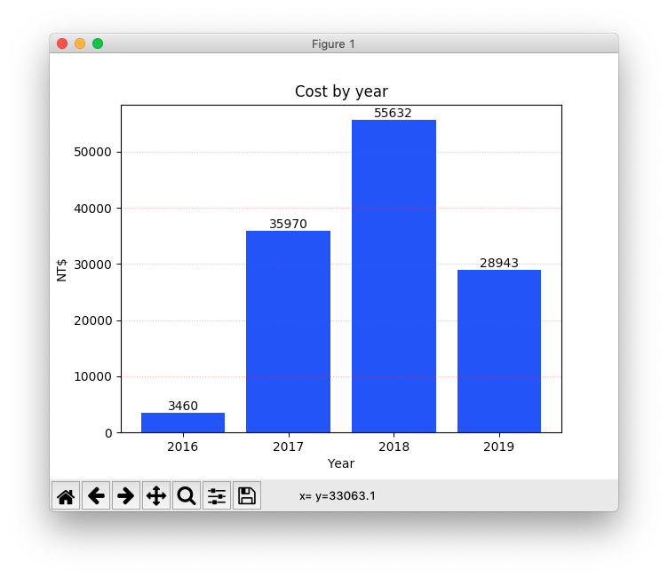
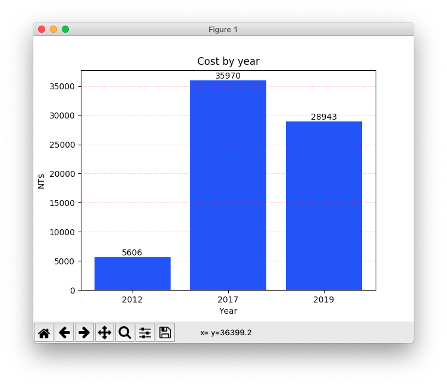
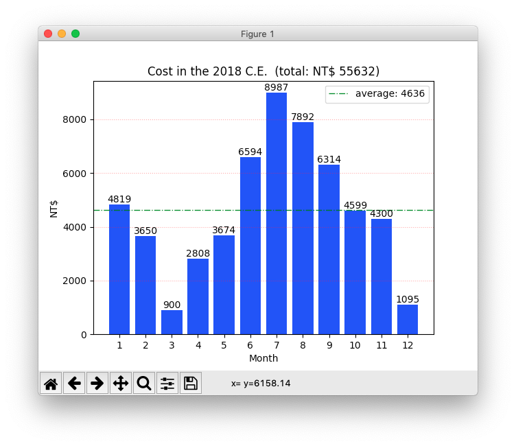

# 查看自己每年都在天瓏網路書店花費了多少錢

## § 前置作業

- 需要 Python 3，請先確認自己的電腦上是否已安裝 Python 3。
- 打開終端機，用 pip 安裝`openpyxl`與`matplotlib`：

```
$ pip3 install openpyxl
$ pip3 install matplotlib
```

## § 下載本 repo

打開終端機，執行：

```
$ git clone https://github.com/kyumdbot/tenlongbar.git
```

切換到`tenlongbar`目錄：

```
$ cd tenlongbar
```

## § 到天瓏網路書店下載購物明細 Excel 檔案

- `會員專區` -> `訂單一覽` -> 按下`匯出購物明細 Excel`。
- 把下載來的 .xlsx 檔案拖曳到`tenlongbar`目錄裡。


## § 執行本程式

### 顯示從`第一筆訂單的年份`到`最近一筆訂單的年份`：

(指令格式：`python3` `tenlongbar.py` `購物明細的 xlsx 檔案`)

```
$ python3 tenlongbar.py order-items-xxxxxxxx.xlsx
```




### 也可指定年份區間 (用`-`符號連接年份)：

(指令格式：`python3` `tenlongbar.py` `購物明細的 xlsx 檔案` `year-year`)

```
$ python3 tenlongbar.py order-items-xxxxxxxx.xlsx '2015-2017'
```




### 如果只指定`起始年份`，會顯示從`起始年份`到`今年`的圖表：

```
$ python3 tenlongbar.py order-items-xxxxxxxx.xlsx '2016-'
```




### 也可以顯示不連續的年份 (用`,`隔開年份)：

(指令格式：`python3` `tenlongbar.py` `購物明細的 xlsx 檔案` `year,year,year`)

```
$ python3 tenlongbar.py order-items-xxxxxxxx.xlsx '2012,2017,2019'
```




### 顯示單一年份裡每個月的花費：

(指令格式：`python3` `tenlongbar.py` `購物明細的 xlsx 檔案` `year`)

```
$ python3 tenlongbar.py order-items-xxxxxxxx.xlsx 2018
```




看到上面這張圖，嚇屎本柴了...掩面...


## § 結語

看了這些圖表後，發現本柴果然是`#衝動型購物`一族的成員啊 (撥髮～)

