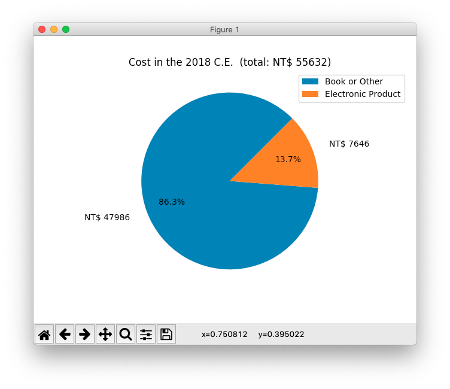

# 查看自己每年都在天瓏網路書店花費了多少錢


## § 前置作業

- 需要 Python 3，請先確認自己的電腦上是否已安裝 Python 3。
- 打開終端機，用 pip 安裝`openpyxl`與`matplotlib`：

```
$ pip3 install openpyxl
$ pip3 install matplotlib
```


## § 下載本 repo

打開終端機，執行：

```
$ git clone https://github.com/kyumdbot/tenlongbar.git
```

切換到`tenlongbar`目錄：

```
$ cd tenlongbar
```


## § 到天瓏網路書店下載購物明細 Excel 檔案

- `會員專區` -> `訂單一覽` -> 按下`匯出購物明細 Excel`。
- 把下載來的 .xlsx 檔案拖曳到`tenlongbar`目錄裡。


## § 執行本程式

### 顯示從`第一筆訂單的年份`到`最近一筆訂單的年份`：

(指令格式：`python3` `tenlongbar.py` `購物明細 xlsx 檔案`)

```
$ python3 tenlongbar.py order-items-xxxxxxxx.xlsx
```


### 也可指定年份區間 (用`-`符號連接年份)：

(指令格式：`python3` `tenlongbar.py` `購物明細 xlsx 檔案` `year-year`)

```
$ python3 tenlongbar.py order-items-xxxxxxxx.xlsx '2015-2017'
```


### 如果只指定`起始年份`，會顯示從`起始年份`到`今年`的圖表：

```
$ python3 tenlongbar.py order-items-xxxxxxxx.xlsx '2016-'
```


### 也可以顯示不連續的年份 (用`,`隔開年份)：

(指令格式：`python3` `tenlongbar.py` `購物明細 xlsx 檔案` `year,year,year`)

```
$ python3 tenlongbar.py order-items-xxxxxxxx.xlsx '2012,2017,2019'
```


### 顯示單一年份裡每個月的花費：

(指令格式：`python3` `tenlongbar.py` `購物明細 xlsx 檔案` `year`)

```
$ python3 tenlongbar.py order-items-xxxxxxxx.xlsx 2018
```


看到上面這張圖，嚇屎本柴了...掩面...

<br>


### 顯示`圓餅圖` (使用 tenlongpie.py)：

我在天瓏網路書店除了買書之外，還會買一些電子開發版，所以我想查看在一個年份裡，購買電子產品佔的比例是多少，所以我寫了另一個 Python 程式來畫圓餅圖：

(指令格式：`python3` `tenlongpie.py` `購物明細 xlsx 檔案` `year`)

```
$ python3 tenlongpie.py order-items-xxxxxxxx.xlsx 2018
```




`tenlongpie.py`會從`category.json`讀取分類資料，`category.json`長得像這樣

```
{
    "default": "Book or Other",
    "category" : {
        "Electronic Product" : ["seeed", "RedBear", "電子套件/開發板", "RASPBERRY-PI"]
    }
}
```
預設類別的名稱叫做`Book or Other`。

在`category`裡我定義了一個類別名叫：`Electronic Product`，後面那個陣列：["seeed", "RedBear", "電子套件/開發板", "RASPBERRY-PI"] 是`購物明細 xlsx 檔案`裡`出版社`那個欄位裡的值，也就是說，我把`出版社`那欄有出現`seeed`、`RedBear`、`電子套件/開發板`、`RASPBERRY-PI`的訂單歸類到`Electronic Product`裡，而不屬於`category`裡列出的，就是屬於`default`類別。

因為天瓏上的電子產品還蠻多樣的，我沒有把所有電子產品的`出版社`的值都寫進去，我只有填我買過的電子零件的`出版社`的值，如果不符合你的情況，你可以自行修改`category.json`。

天瓏網路書店上也有賣 T-shirt，如果你有在上面買 T-shirt，你也可以這樣修改`category.json`：

```
{
    "default": "Book",
    "category" : {
        "Electronic Product" : ["seeed", "RedBear", "電子套件/開發板", "RASPBERRY-PI"],
        "T-shirt" : ["TLGroup"]
    }
}
```

這樣就能把 T-shirt 變成一個獨立的分類。


## § 結語

看了這些圖表後，發現本柴果然是`#衝動型購物`一族的成員啊 (撥髮～)


